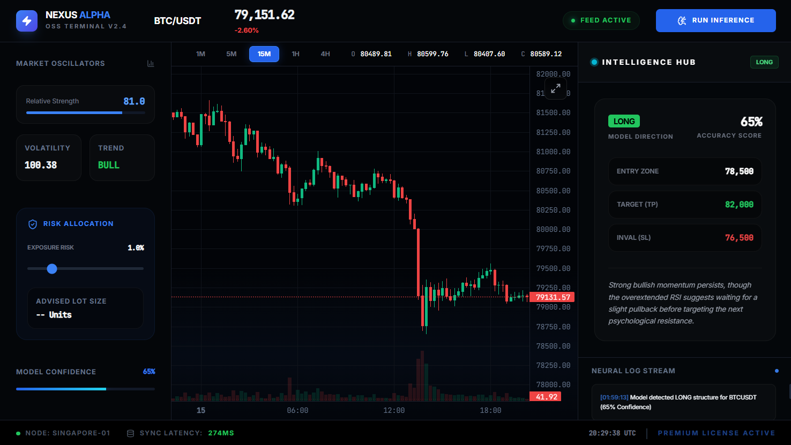

# 🚀 NEXUS ALPHA OSS

> Open Source Institutional AI Trading Terminal



NEXUS ALPHA OSS is a modern trading terminal UI built for developers, traders, and creators who want to build their own crypto trading platform. Whether you're building a trading dashboard, AI assistant, portfolio manager, or fintech product, this project gives you a solid starting point.

## ✨ Features

* **Institutional Trading Terminal UI**: Responsive, high-density dashboard built on a modern dark theme optimized for professional workstations.
* **TradingView Lightweight Charts**: Interactive charting workspace with responsive resizing, custom grid options, and live crosshair data processing.
* **Live Binance Market Data**: Streamlined real-time asset pricing, data syncing, and performance indicators via web endpoints.
* **AI Signal Panel**: Dedicated intelligence hub displaying model directions, entries, targets (TP), invalidation zones (SL), and structured brief summaries.
* **Risk Management Widget**: Dynamically calculates advised lot sizes and asset unit distribution using sliding leverage parameters.
* **Market Oscillators**: Tracks custom metrics including multi-timeframe trend trackers, volatility, and custom mathematical indicators.
* **Confidence Score**: Clear layout components mapping internal model certainties to real-time status visualizers.
* **Multi-Timeframe Support**: Instant state handling transitions between 1M, 5M, 15M, 1H, and 4H visual profiles.
* **Responsive Layout**: Fluid framework architecture that smoothly scales and arranges components on different display monitors.
* **Modern Dark Theme**: Tailored glass-morphism canvas utilizing localized accent borders and subtle technical scanline overlays.
* **Easy to Customize**: Decoupled framework layer allowing seamless drop-in replacements for standard design configurations.

## 📂 Project Structure

This repository includes everything required to start building immediately. The architecture is organized cleanly across individual files to reflect a production project pipeline:

```text
├── index.html
├── style.css
├── utils.js
├── indicators.js
├── chart.js
├── api.js
├── ai.js
├── ui.js
└── app.js
```

### Script Dependency Pipeline

The modular layers are loaded at the bottom of `index.html` in a specific execution sequence to ensure variables and engine parameters resolve correctly:

```html
<script src="utils.js"></script>
<script src="indicators.js"></script>
<script src="chart.js"></script>
<script src="api.js"></script>
<script src="ai.js"></script>
<script src="ui.js"></script>
<script src="app.js"></script>
```

Keeping everything modular makes the project easier to maintain and customize.

## 🔌 APIs

Replace the existing API references with your own services. The system utilizes standard REST web-polling actions. You can configure authentication tokens directly inside the environment settings located inside `ai.js`:

```javascript
const apiKey = "YOUR_API_KEY_HERE";
```

## 🛠 Customize

You can easily modify:

- **Colors:** Tweak baseline palettes using the global variables configured within the CSS root framework.
- **Layout:** Alter structural components using native layout adjustment classes inside the main layout markup.
- **Trading Pairs:** Expand or replace the dropdown assets specified inside the header section.
- **Indicators:** Incorporate advanced technical data points inside the mathematical processor file.
- **AI Logic:** Adjust structure rules, framework prompts, or JSON schema outputs inside the communication module.
- **Risk Engine:** Update calculation weights or default portfolio limits within input event systems.
- **Dashboard Widgets:** Unlink panel components or add sidebar monitoring cells to fit unique specifications.
- **Charts:** Reconfigure chart parameters like grid colors, price lines, or candlestick visual schemes.
- **Backend APIs:** Transition the endpoints to connect directly with your custom web services or active private networks.

## 🚀 Getting Started

Clone the repository:

```bash
git clone https://github.com/yourusername/nexus-alpha-oss.git
```

Open Project Configuration:

Launch the development space and load the `index.html` file.

Add Authentications:

Include your personal key variables inside the specific module files. Start building.

## 📌 Why Open Source?

The goal of this project is to provide developers with a professional trading terminal UI that can be used as a foundation for building custom trading products.

Feel free to fork it, improve it, and build something amazing. If you build something using this project, I'd love to see it!

## ⭐ Support

If you like this project, ⭐ Star the repository. 🍴 Fork it, 💻 Build your own product and share your version with the community.

## ⚠ Disclaimer

This project is intended for educational and development purposes only. Nothing in this repository should be considered financial advice.
